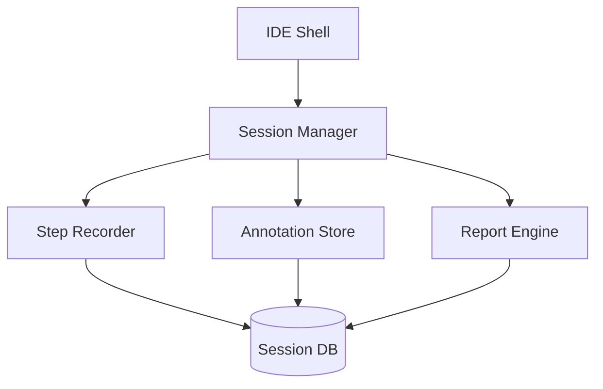

# ADR v1
# Product Sessions-first agent IDE Implementation Specification

_Single source of truth for completing the Product product_

Date: 2026-06-17
Status: Accepted

| Field | Value |
| --- | --- |
| Document status | Draft |
| ADR decision | Complete sessions-first agent IDE |
| Source report | none — direct recon |
| Source generated at | 2026-06-17 |
| Source confidence | high |
| Primary repository | org/repo |
| Primary audience | Engineering team |

## 1. Executive Direction

The product will be a sessions-first agent IDE that gives engineers a structured workspace for running, reviewing, and managing AI agent sessions. It is not a chat interface or a general-purpose code editor. The sessions-first model is the non-negotiable architectural choice that shapes every other decision in this spec.

The immediate goal is to ship a working v1 that passes all acceptance criteria listed in this document. Done means: engineers can start a session, observe its steps, annotate outcomes, and export a structured report — without leaving the IDE.

### Non-negotiable product decisions

- The product is sessions-first: every interaction is rooted in a session entity.
- Sessions are the primary unit of work; chat threads are not persisted as first-class objects.
- The IDE must export structured reports from any session without data loss.

### End product definition

The end product is a working sessions-first agent IDE that ships as v1.

- Engineers can start and name a session from the IDE entry point.
- All agent steps within a session are recorded and displayed in order.
- Engineers can annotate any step with a decision or observation.
- Sessions can be exported as structured HTML or JSON reports.
- The IDE enforces sessions as the primary navigation unit.

## 2. Context and Problem Statement

The engineering team currently lacks a structured workspace for managing AI agent sessions. Existing tools treat agent interactions as ephemeral chat threads with no durable record of decisions made or steps taken. This creates a recall and auditability gap that blocks post-hoc review and structured handoff between engineers.

The source evidence shows that session state management, step recording, and export capabilities are all missing from the current tooling. Every workaround engineers use today — notes files, browser history, copy-pasted logs — represents friction the product must remove. The product exists to eliminate that friction by making sessions first-class objects.

### Current constraints from the source

- No durable session storage exists in the current toolset.
- Agent steps are not recorded in any structured format.
- Export is manual and lossy, relying on copy-paste.

### Primary engineering problem

The core engineering problem is the absence of a session entity that persists agent steps in a queryable, exportable structure. Without this foundation, every downstream feature — annotation, export, search — has no reliable data to work with.

## 3. Scope

### In scope

- Session creation, naming, and lifecycle management.
- Step recording within a session including agent output capture.
- Annotation of steps with engineer decisions and observations.
- Export of sessions as structured HTML and JSON reports.
- Session list and navigation within the IDE.

### Out of scope

- General-purpose code editing or file management.
- Integration with external CI/CD pipelines.
- Multi-user collaboration or shared session editing.

## 4. Architecture Decision Record

### ADR-2026-06-17: Complete sessions-first agent IDE

| Field | Value |
| --- | --- |
| Status | Accepted |
| Decision owner | Engineering lead |
| Decision date | 2026-06-17 |
| Decision outcome | Build sessions-first IDE with structured export |

### Decision drivers

- Engineers need a durable record of agent sessions to enable post-hoc review.
- Session auditability is a product invariant that must not be broken.
- Export must be deterministic and lossless to support structured handoff.
- The IDE must be operable without external dependencies at the session level.

### Accepted decisions

| ID | Decision | Instruction |
| --- | --- | --- |
| D-1 | Sessions are the primary unit of work | Every UI interaction must be rooted in a session entity |
| D-2 | Steps are append-only records | Never mutate or delete a step; archive instead |
| D-3 | Export is deterministic | Given the same session state, export must produce the same output |
| D-4 | Annotations are first-class | Annotations must be stored with the step, not as metadata |
| D-5 | Reports are self-contained | An exported report must include all session data inline |

### Rejected alternatives

| Rejected alternative | Reason |
| --- | --- |
| Chat-first architecture | Does not support durable step recording without a session root |
| File-based session storage | Lacks structured queryability and is fragile across renames |
| External export service | Introduces a network dependency for a local-first operation |

### Consequences

- Session storage must be designed for append-only writes from day one.
- The export pipeline must be tested against all session shapes.
- Annotations require a migration path when the step schema changes.
- Performance testing must cover sessions with 100+ steps.

## 5. Target Architecture

### Component boundaries

| Component | Owns | Must not own |
| --- | --- | --- |
| Session manager | Session lifecycle, step recording | UI rendering, export formatting |
| Step recorder | Append-only step log | Session metadata, annotations |
| Annotation store | Annotation CRUD | Session lifecycle, report generation |
| Report engine | Deterministic export | Session state, step mutation |

### Topology



### Layering rules

- The IDE shell may only call the session manager; it must not call step recorder or annotation store directly.
- The report engine reads from the session DB; it must not write.
- No domain component may import from the IDE shell layer.

### Canonical data flows

- Session start: IDE shell → session manager → session DB (create session record).
- Step record: agent output → step recorder → session DB (append step).
- Annotation: engineer action → annotation store → session DB (upsert annotation).
- Export: engineer triggers → report engine → reads session DB → renders HTML/JSON.

## 6. Functional Requirements

Each requirement is release-blocking unless marked optional.

### FR-1 Session Creation

### Intent

Engineers must be able to create a named session from the IDE entry point.

### Required behavior

- The session creation form must accept a name of 1–100 characters.
- A session ID must be generated and stored at creation time.
- The session must appear in the session list immediately after creation.

### Acceptance criteria

- Given an engineer opens the IDE, when they submit a valid name, then a session is created and listed.
- Given a blank name, when submitted, then creation is rejected with a validation error.
- Given a name at the 100-character limit, when submitted, then the session is created successfully.

### Required verification

- Unit test: session manager creates a session record with the correct ID and name.

### FR-2 Step Recording

### Intent

Every agent step within a session must be captured in order.

### Required behavior

- Each agent output must be recorded as a step with a timestamp and sequence number.
- Steps must be stored in append-only order; no mutation of existing steps.
- The step recorder must handle concurrent writes without data loss.

### Acceptance criteria

- Given an active session, when an agent produces output, then a step is recorded with the correct timestamp.
- Given two simultaneous agent outputs, when recorded, then both steps appear in sequence order.
- Given a session with 100 steps, when listed, then all 100 steps are present in sequence order.

### Required verification

- Integration test: step recorder appends steps correctly under concurrent writes.

### FR-3 Annotation

### Intent

Engineers must be able to annotate any step with a decision or observation.

### Required behavior

- An annotation must be associatable with any step in any session.
- Annotations must be stored with the step, not as a separate metadata layer.
- An annotation must support at least 1000 characters of text.

### Acceptance criteria

- Given a step, when an engineer submits an annotation, then the annotation is stored and displayed.
- Given an existing annotation, when the engineer edits it, then the updated text is saved.
- Given a step with an annotation, when the session is exported, then the annotation is included.

### Required verification

- Unit test: annotation store correctly associates an annotation with its step ID.

### FR-4 Export — HTML

### Intent

Sessions must be exportable as self-contained HTML reports.

### Required behavior

- The HTML export must include all steps, annotations, and session metadata.
- The export must be deterministic: the same session state must produce the same HTML.
- The exported HTML must be renderable without network access.

### Acceptance criteria

- Given a session with steps and annotations, when exported as HTML, then the output is a valid self-contained HTML file.
- Given the same session exported twice, then both outputs are byte-for-byte identical.
- Given an HTML export, when opened in a browser without internet, then all content renders correctly.

### Required verification

- Unit test: report engine produces identical output for the same session state across multiple runs.

### FR-5 Export — JSON

### Intent

Sessions must be exportable as structured JSON for downstream tooling.

### Required behavior

- The JSON export must include the session ID, name, all steps, and all annotations.
- The JSON schema must be stable across v1 releases.
- The JSON export must be parseable by standard JSON parsers.

### Acceptance criteria

- Given a session, when exported as JSON, then the output conforms to the declared schema.
- Given an exported JSON file, when parsed, then all session data is recoverable without loss.
- Given a JSON export, when validated against the schema, then it passes without errors.

### Required verification

- Unit test: JSON export round-trips all session fields without data loss.

### FR-6 Session List

### Intent

Engineers must be able to navigate all sessions from the IDE entry point.

### Required behavior

- The session list must display all sessions ordered by creation date descending.
- Each entry must show session name, creation date, and step count.
- The list must update in real time when a new session is created.

### Acceptance criteria

- Given three sessions created in sequence, when the session list is viewed, then they appear newest-first.
- Given a session with 42 steps, when shown in the list, then the step count reads 42.
- Given a new session created while the list is open, then the list updates without a manual refresh.

### Required verification

- Integration test: session list renders correctly after session creation.

## 7. Non-Functional Requirements

| Quality attribute | Requirement |
| --- | --- |
| Reliability | Session data must survive an IDE process crash with no data loss. |
| Security | Sessions must be scoped to the authenticated engineer; no cross-session reads. |
| Privacy | Session content must not be transmitted off-device without explicit engineer action. |
| Maintainability | Every module must have ≥80% unit-test coverage at the line level. |
| Performance | Session list with 500 sessions must render in under 200ms. |
| Accessibility | All IDE controls must be operable via keyboard and must pass WCAG 2.1 AA. |

## 10. Settings, Flags, and Configuration

| Setting / flag | Decision | Required behavior |
| --- | --- | --- |
| session.max_steps | 1000 | Reject step recording once the limit is reached; surface a warning. |
| export.format | html, json | Default to html; accept json as an override flag. |
| ide.theme | system | Follow the system dark/light mode by default. |

### Documentation update requirements

- Update the user guide with session creation and export workflows.
- Update the API reference when the session schema changes.
- Update the changelog for every flag introduced or removed.

## 11. Implementation Plan

### Phases

| Phase | Name | Engineering instructions | Exit gate |
| --- | --- | --- | --- |
| 1 | Session core | Implement session manager and step recorder with unit tests | All unit tests pass; session can be created and steps recorded |
| 2 | Annotation | Implement annotation store and wire to session manager | Annotation CRUD passes unit tests; annotations appear in session view |
| 3 | Export — HTML | Implement report engine HTML output; determinism test | HTML export is byte-for-byte deterministic across three runs |
| 4 | Export — JSON | Implement report engine JSON output; schema validation | JSON export round-trips all fields; schema validation passes |
| 5 | Session list + IDE shell | Wire session list UI; connect all components | Session list displays all sessions; IDE shell passes integration smoke test |

### Workstream ownership

| Workstream | Accountable owner | Primary deliverables |
| --- | --- | --- |
| Session core | Backend lead | Session manager, step recorder, DB schema |
| Annotation | Full-stack lead | Annotation store, UI annotation form |
| Export | Backend lead | Report engine HTML + JSON, schema definition |
| IDE shell | Frontend lead | Session list, entry point, routing |

### Common engineering instructions

- All public interfaces must have a corresponding unit test before the interface is shipped.
- No feature merges unless the exit gate for its phase is met.
- All exported types must be documented with a one-line description.
- Performance tests must run as part of the CI pipeline, not as manual checks.
- Security review must be completed before Phase 5 ships.

## 12. Test and Verification Strategy

### Required test tiers

| Tier | Required coverage | Examples / target areas |
| --- | --- | --- |
| Unit | ≥80% line coverage per module | Session manager, step recorder, annotation store, report engine |
| Integration | All data flows between components | Session creation → step recording → annotation → export |
| Snapshot | Deterministic export output | HTML and JSON report engine output |
| Accessibility | WCAG 2.1 AA across all IDE controls | Keyboard navigation, screen reader labels |
| Performance | P95 latency for session list render | 500-session list render under 200ms |

### Release-blocking verification checklist

- All unit tests pass with ≥80% line coverage.
- All integration tests pass end-to-end.
- HTML export is byte-for-byte deterministic across three independent runs.
- JSON export round-trips all session fields without data loss.
- Session list renders 500 sessions in under 200ms.
- All IDE controls pass WCAG 2.1 AA automated checks.

### Acceptance scenarios

| Scenario | Given | When | Then |
| --- | --- | --- | --- |
| Session creation | An engineer opens the IDE | They submit a valid session name | A session is created and appears in the list |
| Step recording | An active session exists | An agent produces output | A step is appended in sequence order |
| Annotation | A session has a recorded step | The engineer submits an annotation | The annotation is stored and shown with the step |
| HTML export | A session has steps and annotations | The engineer requests HTML export | A self-contained HTML file is produced |
| JSON export | A session has steps and annotations | The engineer requests JSON export | A valid JSON file is produced that round-trips all data |

## 13. Definition of Done

### Product-level definition of done

- All six functional requirements pass their acceptance criteria in a live demo.
- All unit, integration, snapshot, accessibility, and performance tests pass.
- The HTML and JSON export are byte-for-byte deterministic.
- Session data survives an IDE process crash with no loss.
- The session list renders 500 sessions in under 200ms.
- All IDE controls pass WCAG 2.1 AA automated checks.
- The user guide is updated with session creation and export workflows.
- A changelog entry is published for every feature shipped in v1.

### PR-level definition of done

- The PR includes unit tests for every new public interface.
- All existing tests still pass after the change.
- The PR description links to the relevant FR or spec section.
- Code review is complete with at least one approval.
- No new lint errors or type errors are introduced.
- The PR is rebased onto main with no merge conflicts.

## 14. Rollout and Rollback

### Rollout sequence

- Deploy the session core (Phase 1) to the engineering dog-food environment.
- Validate step recording under real agent workloads in the dog-food environment.
- Deploy annotation support (Phase 2) and collect engineer feedback.
- Deploy export (Phases 3–4) and run the determinism test suite against the live build.
- Deploy the IDE shell (Phase 5) and run the full acceptance scenario suite.

### Rollback criteria

- Any acceptance scenario fails in production after deploy.
- Session data is lost or corrupted after a process crash.
- HTML export is non-deterministic across back-to-back runs.
- Performance SLA is breached: session list exceeds 200ms P95.

### Operational readiness

- An on-call runbook exists for session DB recovery.
- All monitoring dashboards are wired to the session manager error rate.
- The rollback procedure is documented and tested in the dog-food environment.

## 15. Risk Register

| ID | Risk | Severity | Likelihood | Owner | Mitigation |
| --- | --- | --- | --- | --- | --- |
| R-1 | Session DB corruption on crash | high | low | Backend lead | Use append-only writes; add crash-recovery test |
| R-2 | Concurrent step recording data loss | high | medium | Backend lead | Add concurrency test; use database-level locking |
| R-3 | Export non-determinism | medium | low | Backend lead | Add determinism test to CI pipeline |
| R-4 | WCAG compliance gap | medium | medium | Frontend lead | Run automated a11y checks in CI |
| R-5 | Performance regression on large session lists | medium | medium | Full-stack lead | Add P95 latency test to CI |

### Risk handling directives

- Any high-severity risk with medium or higher likelihood blocks the release.
- All risks must have an owner assigned before Phase 1 ships.
- Risk mitigations must be verified by the exit gate of the phase they apply to.

## 16. Traceability Matrix

| Source observation / risk | Spec decision or requirement | Verification |
| --- | --- | --- |
| No durable session storage in current tooling | D-1: sessions are the primary unit of work | Integration test: session persists across IDE restarts |
| Steps are not recorded in any structured format | FR-2: step recording | Unit test: step recorder stores steps in sequence |
| Export is manual and lossy | FR-4, FR-5: HTML and JSON export | Snapshot test: export is deterministic and lossless |
| No cross-session access controls | NFR: security | Security review: session scoping enforced at data layer |
| Performance gap for large session lists | FR-6: session list | Performance test: 500-session list under 200ms |

## 17. Engineering Backlog

### Required epics and representative stories

| Epic | Representative stories |
| --- | --- |
| E-1 Session core | Create session, record step, retrieve session by ID |
| E-2 Annotation | Add annotation to step, edit annotation, retrieve annotations for session |
| E-3 Export — HTML | Export session as HTML, verify determinism, render without network |
| E-4 Export — JSON | Export session as JSON, validate schema, round-trip data |
| E-5 IDE shell | Display session list, navigate to session, create session from UI |

### Suggested issue template

```markdown
## Summary
<!-- One sentence: what this story delivers. -->

## Acceptance criteria
- [ ] ...

## Notes
<!-- Context, constraints, or links to spec sections. -->
```

## 18. Appendix A — Source Evidence Summary

### Architecture invariants from source

| Invariant | Status | Evidence reference |
| --- | --- | --- |
| Sessions are the primary unit of work | upheld | docs/architecture/sessions.md:12 |
| Steps are append-only | upheld | docs/architecture/step-recorder.md:8 |
| Export is deterministic | at-risk | tools/report-engine/src/render.js:44 |
| No cross-session reads | upheld | src/session-manager/access.js:22 |

### Open decisions resolved

| Original open decision | Recommendation | Resolution |
| --- | --- | --- |
| Should annotations be stored with steps or separately? | With steps, as first-class data | D-4: annotations are first-class |
| Should export be sync or async? | Sync for v1 to keep the contract simple | FR-4/FR-5: export is synchronous |
| Should the session list be paginated? | Virtualized list, not paginated, for v1 | FR-6: session list is virtualized |

### Relevant source paths

- docs/architecture/sessions.md:1–50
- docs/architecture/step-recorder.md:1–40
- tools/report-engine/src/render.js:1–100
- src/session-manager/access.js:1–60
- tests/integration/session.test.js:1–80

## 19. Appendix B — Glossary

| Term | Meaning |
| --- | --- |
| Session | A named, durable workspace for one agent run or a related group of agent steps. |
| Step | An append-only record of one agent output within a session. |
| Annotation | An engineer-authored note associated with a specific step. |
| Export | A deterministic, self-contained rendering of a session as HTML or JSON. |
| Session list | The IDE view that displays all sessions ordered by creation date. |
| Report engine | The module responsible for producing deterministic exports from session data. |

## 20. Final Release Gate

All six functional requirements must pass their acceptance criteria in a live demo before v1 ships. The engineering lead signs off against this spec and the test results.

### Sign-off checklist

- All FR acceptance criteria pass in a live demo environment.
- All test tiers pass: unit, integration, snapshot, accessibility, performance.
- The changelog entry for v1 is published.
- The user guide is updated and reviewed.
- The on-call runbook is complete and tested.
